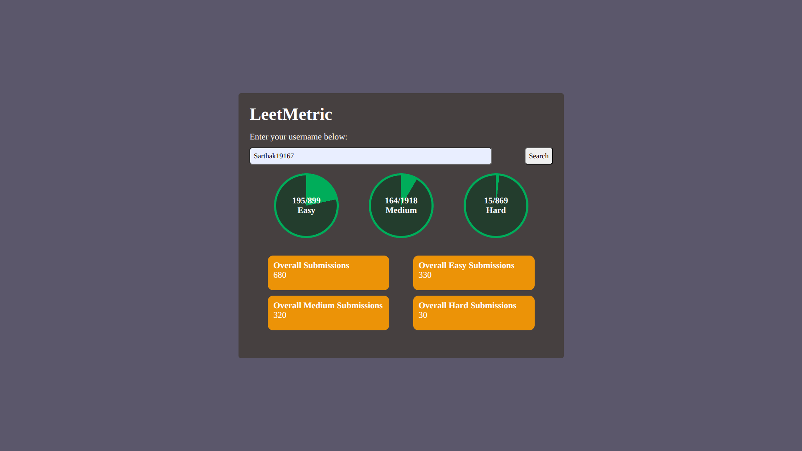

# LeetMetrix

LeetMetrix is a simple web app built with **HTML, CSS, and JavaScript** that lets you view your LeetCode stats by entering your username.  
It displays useful information like:
- Number of questions solved  
- Number of submissions made  

## Features
- Clean and minimal UI  
- Real-time stats fetching  
- Easy to use — just enter your LeetCode username  

## Screenshot
<!-- Replace the below line with an actual screenshot -->


## How to Use
1. Clone this repository  
   ```bash
   git clone https://github.com/SarthakJain10/LeetMetrix.git
